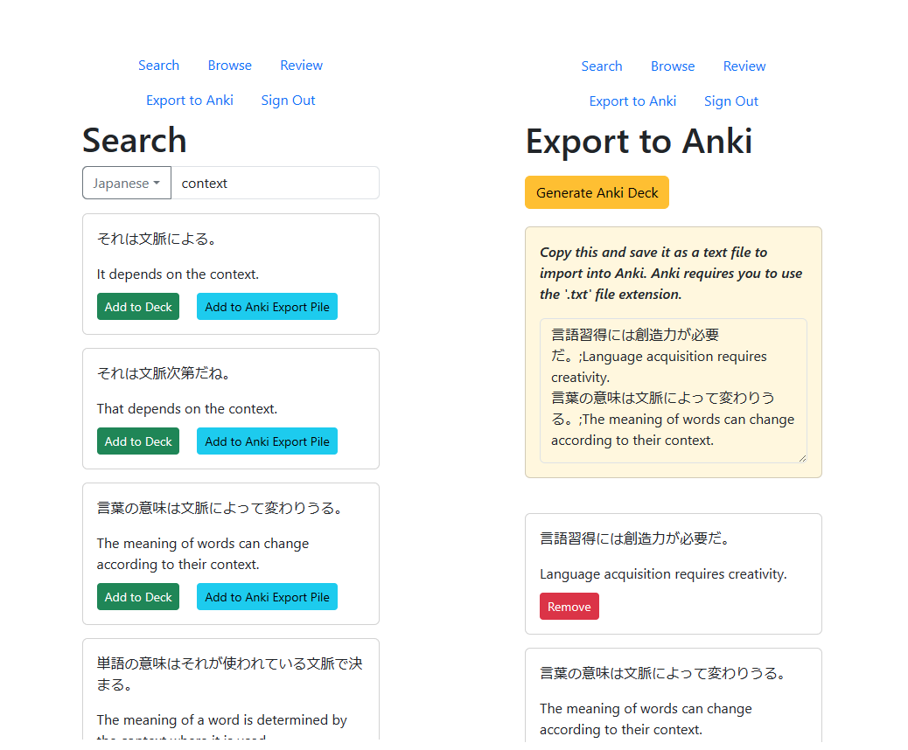
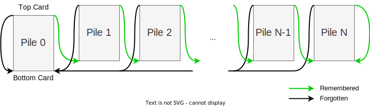

# context-cards

SRS for learning languages. You can

- Search Tatoeba example sentence database
- Create sentence cards in one click
- Export cards to Anki in one click
- Synchronise cards between devices in real time

The SRS algorithm is quite rudimentary, as illustrated by the flow chart below. Piles with a lower value represent sets of cards that are less well known to the user. We use a small number of piles (N = 5 at the moment) to achieve a better sorting speed.

