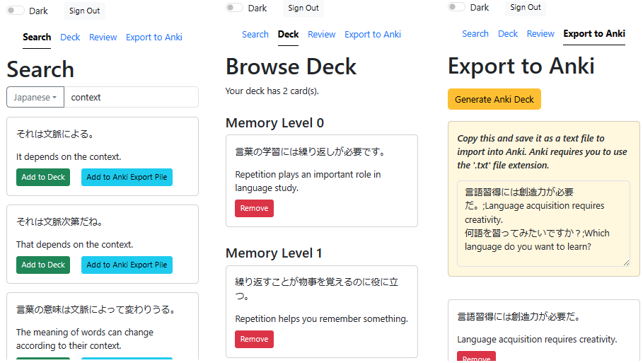

# context-cards

SRS for learning languages. You can

- Search Tatoeba example sentence database
- Create sentence cards in one click
- Export cards to Anki in one click
- Synchronise cards between devices in real time **(work in progress)**

## SRS Algorithm

We use a basic SRS algorithm involving a discrete number of piles, as shown below. The pile number indicates how well the user has memorised the cards within that pile.  
  
Piles are randomly selected with a probability distribution that favours lower numbered piles.

